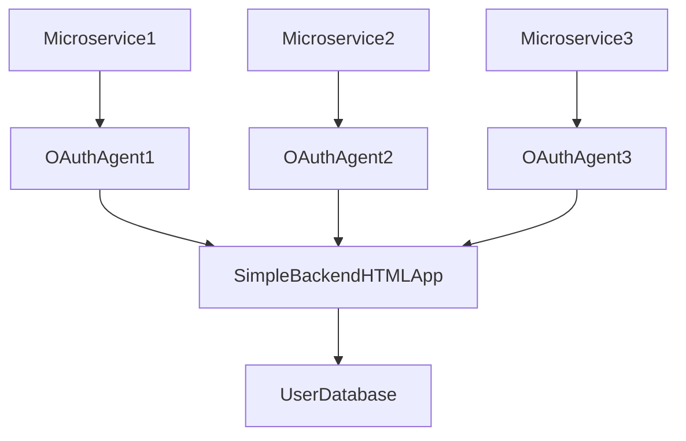
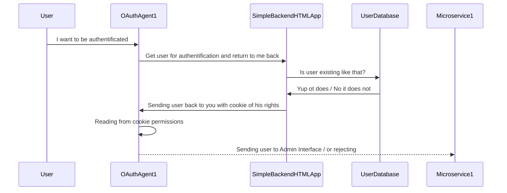

# Description

Idea for pet project

- implement authentificating application for central management of users for access to admin/moderator interfaces
- SimpleBackendHTMLApp is a simple backend application in Django with its Django Admin interface
- OAuthAgent1 is a golang redirecter, and verifier of authentifcation.
- Microservice1, and admin interface that needs to be protected

# Diagrams

